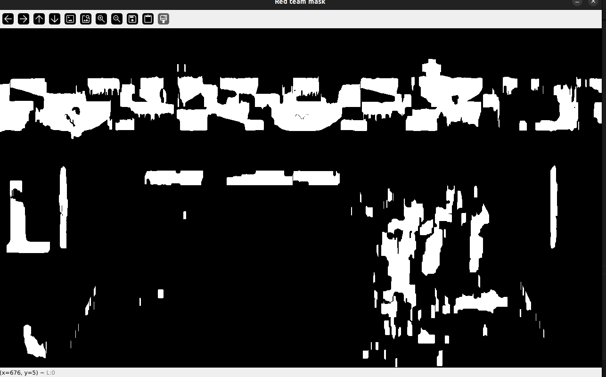
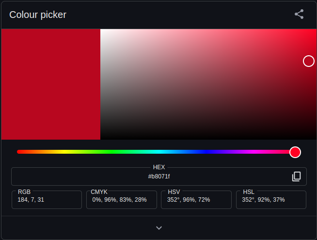

# Task 6
## Description

Timothy being a reptile has eyes on either side of his face and his having trouble keeping track of the Ball in a match between two teams. Can you help him out?

Use opencv to help Tim consitently track the ball.

Implementation

The task is to use opencv functionalities and  track the trajectory of the ball in the given video of a volleyball match. You may choose to either trace the ball's path, or highlight its current location while it moves. Also find the number of players in each team.

## Documentation
## Approach and Challenges
I tried using Houge gradient for detecting circles is not reliable as it uses greyscale input which causes other circular objects to be detected as the ball.

After trying few other methdods, best results were seen in using Gaussian Blur to blur the image and mask the frames based on color (yellow here). 

One more challenge faced here is, the ball in not completely yellow, it has blue stripes. But the colors of the ball are not seen as they are due to camera angle and lighting. To make up for this, I decided to pass the masked frame through Dialution and erosion.


I think the range of yellow can be optimised to NOT include the players who are also wearing jersey of color yellow.


To distinguish between other contour and the ball to be tracked, I use the circularity of the ball. This however this has its own disadvantage as the score is capped between values when the ball moves very far from the camera or is very near the camera, it is not detected.
```
def circularity(area,perimeter):
    #score based on area and perimeter as real life objects are not perfecty circular or may have color variations.
    if area > 0:
        score =  (4 * np.pi * area) / (perimeter ** 2)
        return score
    else:
        return 0
```

Almost the same logic can be used for players, masking based on colour and finding the contours of a certain area range. But in the current case the one of the team has jersey colored same as the floor, making it difficult to mask out the players. 

The Image bellow shows the mask in one of the red range. This is detecting the stands, similarly it starts detecting floor. Due to changeing lighting and camera angles it is a bit difficult to get the range right as the range is small and divided into two parts.

## Tracking the players
As mentioned it is hard to get the range of the red team jersey right as in HSV due to its circular nature, red is devied in two ranges. However this was not the case with yellow. After trying a few other methods, selection based on area and shape of bounding rectangle gave good results.

```
def FindPlayer(image,upper,lower,name):
    hsv = cv.cvtColor(image,cv.COLOR_BGR2HSV)
    blur = cv.GaussianBlur(hsv,(7,7),0)
    mask = cv.inRange(blur,lower, upper)
    cv.imshow(f"{name} mask",mask)
    mask = cv.erode(mask,(5,5),iterations= 10)
    mask = cv.dilate(mask,(5,5),iterations=15)
    cv.imshow(f"{name} mask",mask)
    player = []
```
This function masks out teams based on colour of jersey. I found it helpful to erode the image first then dialate, which significantly reduces noise as area in intrest is big and consistant(the torso of the players).

Another function for the orientation of rectangle helped reduce flase detection more, as it is seen the yellow team players seem to be cut in half by net. So this function considers h>w and  w < h to some range, this helps make it a bit more accurate. 
```
def IsRectangle(l,b):
    ratio = l/b
    if 0.7<ratio<=3:
        return 1
    else: return 0
``` 

