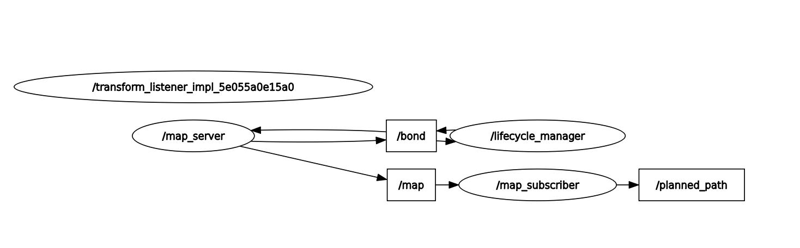
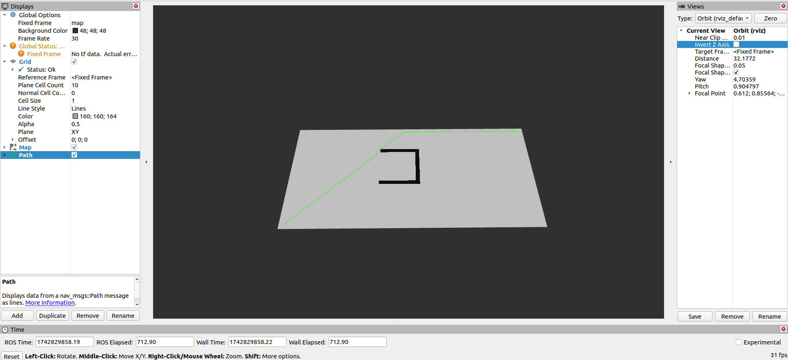
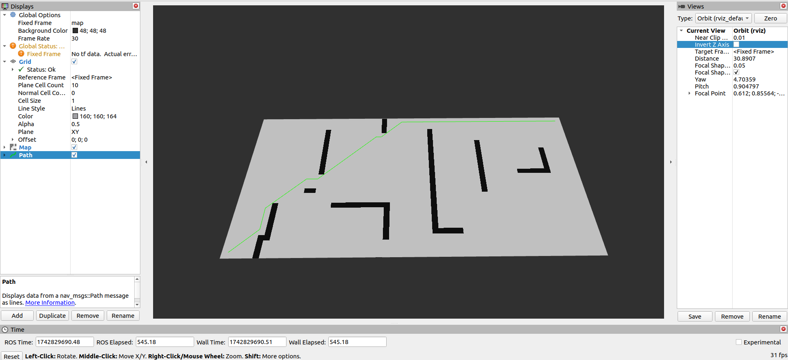
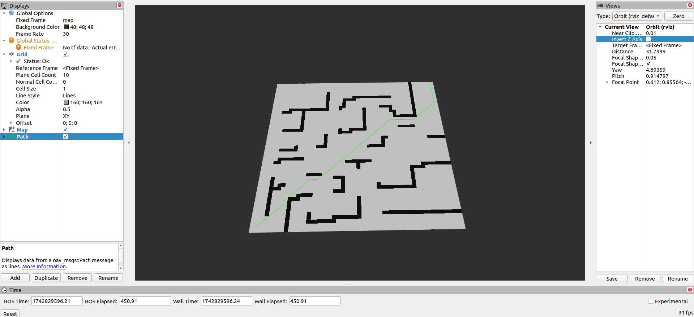

# beROSgar
## TASK 7

## Description
Tim was returning back from the volleyball match, but seems to have lost his way, can you help him out?

Implementation

Implement A* path-finding algorithm FROM SCRATCH on a map in a C++ node.

Your planner node must subscribe to the map and publish the path as a nav_msgs/Path on the map avoiding all the obstacles.

Visualize and debug your path using Rviz.

## Documentation


### Subscriber
The ```map_subscriber``` subscribes over the topic ```/map```, Where the AStar algorithm is implemented. The algorithm receives map data in form of occupancy grid message.

The obstacles are represented by value 100 and free space by value 0. 

### AStar
I had used Manhattan distance in this algorithm keeping in mind the grid system of maps. Movement in up,down,right and left have cost of 1 unit. Later I switched to diagonal movements, I changed the distance metrics to Euclidean. The function ```Backtrack()``` helps to go back from Goal to start using parent which is a pair stored in the class Block, which tells how the path was traversed. 

```Backtrack()``` function returns a set of waypoints, which are passed as ```Path``` message.

### Results:
#### map_test

#### map_basic

#### map_maze
